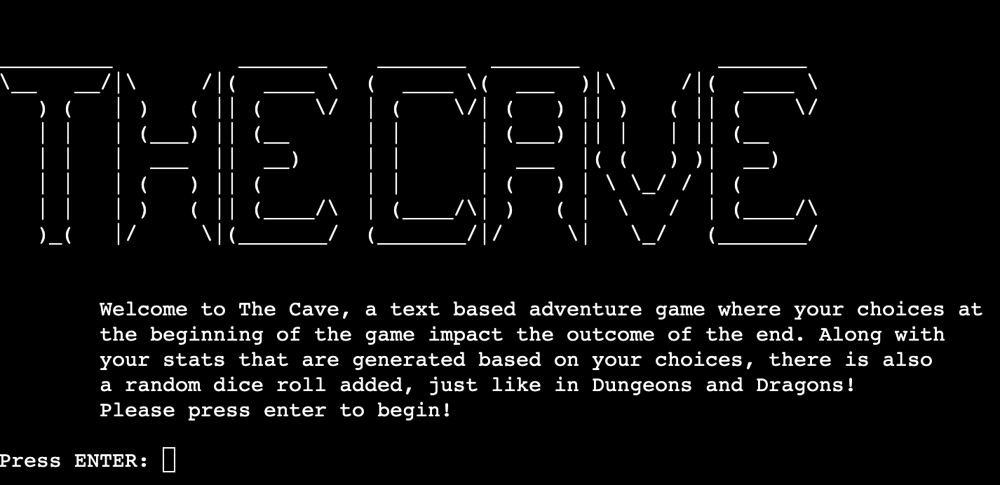
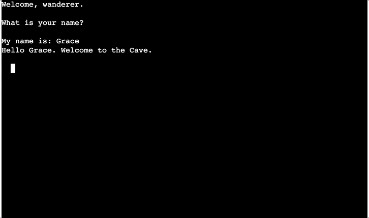
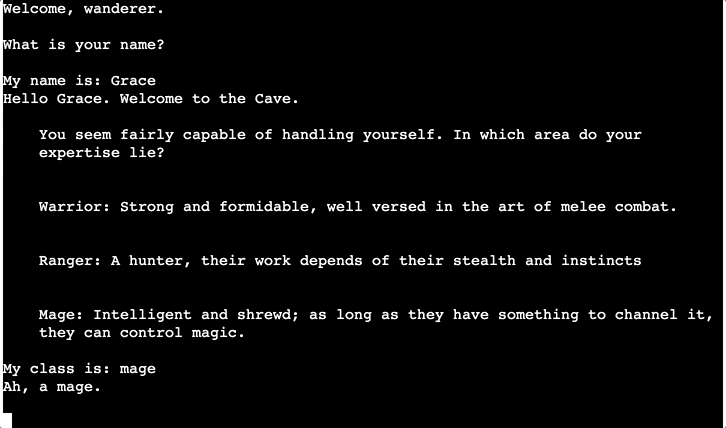
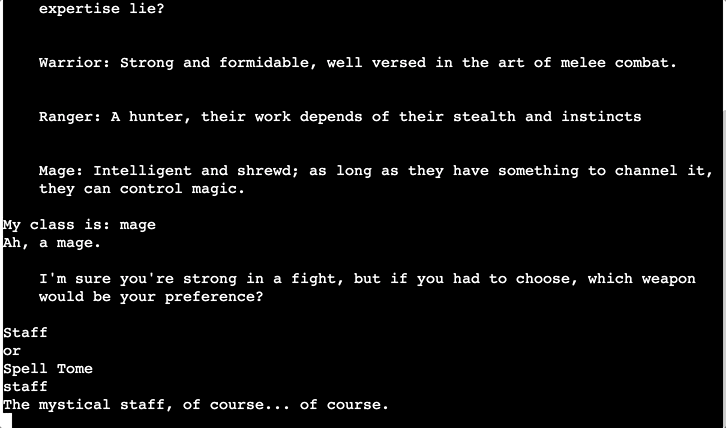
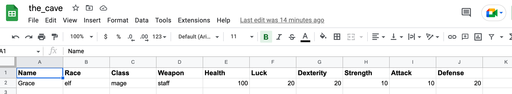
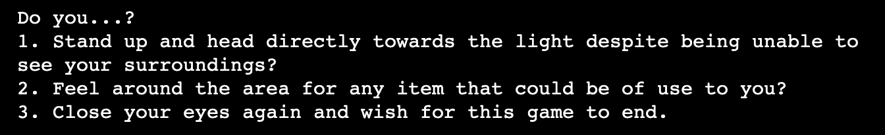
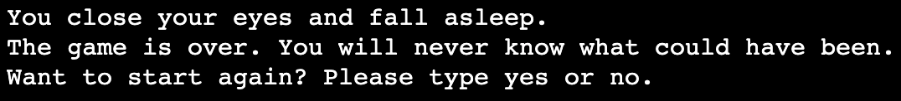

 

# Table of Contents

- [Table of Contents](#table-of-contents)
- [Site Overview](#site-overview)
  - [Goal](#goal)
  - [Technologies used](#technologies-used)
- [UX](#ux)
  - [Target Audience](#target-audience)
- [Features](#features)
  - [Existing Features](#existing-features)
  - [Future Features](#future-features)
- [Design](#design)
- [Testing](#testing)
  - [Bugs](#bugs)
  - [Known Issues](#known-issues)
- [Deployment](#deployment)
  - [Deployment to Heroku](#deployment-to-heroku)
  - [How to Fork](#how-to-fork)
- [Credits](#credits)
  - [Code](#code)
    - [Version Control](#version-control)
- [Acknowledgments](#acknowledgments)
   
  - [Future Features](#future-features)
- [Table of Contents](#table-of-contents)
- [Site Overview](#site-overview)
  - [Goal](#goal)
  - [Technologies used](#technologies-used)
- [UX](#ux)
  - [Target Audience](#target-audience)
- [Features](#features)
  - [Existing Features](#existing-features)
  - [Future Features](#future-features)
- [Design](#design)
- [Testing](#testing)
  - [Bugs](#bugs)
  - [Known Issues](#known-issues)
- [Deployment](#deployment)
  - [Deployment to Heroku](#deployment-to-heroku)
  - [How to Fork](#how-to-fork)
- [Credits](#credits)
  - [Code](#code)
    - [Version Control](#version-control)
- [Acknowledgments](#acknowledgments)

# Site Overview
Deployed Site: [Here](https://the-cave-rpg.herokuapp.com/)

The Cave is a text adventure RPG game where the player choses their race, class and preferred weapon. These initial decisions impact the player's stats in-game and whether or not they will be able to escape the cave alive! Decisions that impact the game are stored in Google Sheets and are retrieved when relevant to the game.

## Goal
I wanted to create a text based adventure game based on the "Choose your own adventure" books I used to read as a child, while also incorporating some Dungeons & Dragons elements to the game. My goal was to create something that has been done before but with an added twist of your decisions actually impacting whether or not luck will be on your side.

## Technologies used

- [Python](https://www.python.org/) for the main game-play.
- [GitHub](https://github.com/) as a remote repository.
- [Heroku](https://heroku.com) to deploy the website.
- [Visual Studio Code](https://code.visualstudio.com/) as a local IDE & repository.
- [diagram.net](https://diagram.net) for making the flowchart for the game.
- [patorjk.com](https://patorjk.com/software/taag/#p=display&f=Graffiti&t=Type%20Something%20) for converting text to ascii art.
- [canva](https://www.canva.com/) for my README banner.
# UX
## Target Audience

- Old school RPGers who would have played choose your own adventure novels in their youth
- People who are fans of Dungeons and Dragons
- Those who enjoy basic text adventure games
- Those who enjoy interactive novels

# Features

## Existing Features
- Intro Screen:
The intro screen that shows when the player first loads the game was made using a text to ascii art generator. This section of the program gives the user a clear idea of how the game works and what to expect. The user must press 'Enter' to trigger the start of the game, otherwise the intro screen will stay as it is.

- Player Name:
The player can here enter their name. It will then be stored in the database in the linked Google Sheet until the next player begins the game. Note: text speed in these examples is faster as snippets were taken while testing. Speed was increased to help with testing.

- Player Class:
  Like the player name, the player is then given the choice of three classes to choose from. This is the first choice which will impact the player's statistics. The player class is then uploaded to the Google Sheet also and their statistics are updated.

- Preferred Weapon:
  The player is then asked to choose which weapon they prefer to use. The weapons offered to the player depend on which class they have chosen before. In this example, because the player chose to be a mage, they were offered a staff or spell tome. Should they have picked warrior or ranger, they would have had the choice of a sword or axe, or a bow or dagger. This choice is important later in the game when the player has the chance to obtain a weapon. If the weapon they find matches their preferred weapon, they get a better attack stat boost.

- Player Race:
  The last major decision the player must make before really beginning the game is which race they will be. Again, depending on their choice, their stats will be altered. Dwarves have better strength, elves have better dexterity etc. 

- Google Sheet:
After playing the game as above, our google sheet will now look like below. The player does not see this but the sheet is where their statistics are stored, their inventory etc. Some events only appear to the player if they have a certain object in their inventory for example, such as a light source or the key. 

- Exit Game:
  For every decision, the player is given an opportunity to end the game and exit, usually as option 3.
  
  After the player has selected this option, they are then given the option to restart the game and play again. If they type yes, they will be brought back to the section of the game where they input their name and the Google Sheet will be reset.
  

## Future Features
- Colour :
  I would like to incorporate some colour into the game if I had the time. I feel like this might help give it some life.
- Store Player Outcomes:
  Potentially storing each player's name and whether or not they escaped. I'd love to include this as a scoreboard on the intro screen. 
- Add more events, weapons, classes and races.
- Add more in-depth enemy encounters. I had initially planned on the fight with the skeleton to have more outcomes, such as him hitting you and doing a certain amount of damage to reduce your HP. Due to time constraints I had to reduce work done on that and make it a bit more basic. In the future I would prefer to have the player's HP make more of a difference to the story.
- Show player HP/Defence/Attack etc in some sort of banner.
- In truth, there are a lot of things I would love to do with this game in the future, but I think to implement them I would have to remove the need for the google spreadsheet and store the player information internally. This would mean quite a lot of re-writing code, which unfortunately I do not have time for at the moment.

# Design
Below is the flowchart I made to follow along while coding. I initially wrote this out on paper and then used [diagrams.net](https://www.diagrams.net/) to create it digitally.

# Testing
Testing document can be found [here](TESTING.md)
## Bugs

Bug | Status | Fix | Images of bug
----|--------|-----|--------------
Regardless of class chosen, player was only given warrior options for weapons | Resolved | Rather than just use '==' for one class and 'or' for second option, use '==' for both classes. | 
Large gap between line breaks instead of starting on new line | Resolved | Instead of using 'backslash', started new string. | 
Health points were not being updated after player suffers HP loss | Resolved | I had forgotten to add .value to the statement. | 
Using if statements in main file caused the failure function to trigger and prevented HP from updating | Resolved | Placed update hp function in events.py in failure function | 
Dagger would not upload to sheet and caused UnboundLocalError | Resolved | I only assigned the worksheet variable in one of the if statements rather than all of them. I fixed this by adding it to each if statement | 
Couldn't reach worksheet | Resolved | I accidentally mixed up functions and added "get_" before worksheet in my code | 
Start_game() function after player is asked if they want to play again doesn't start at the very beginning, instead at the start of wake_up() | Resolved | Enclosed code in variables.py in function and called function in run.py | 
Preferred weapon function gets confused due to uppercase or lower case entry by player | Resolved | Changed so player only types in lowercase |  
Error when attempting to run stat.roll_luck in luck_fail() functions | Resolved | Was missing () | 
After killing the skeleton in stage 4, game did not continue | Resolved | Forgot to add stage_5() after print statement | 
Game did not recognise player had light source if it was a lantern | Resolved | Changed to elif statement instead of multistatement | 
## Known Issues
- I am unsure how the game would work if more than one person tried to play at the same time. I believe because one person would overwrite the info of the other it would cause issues.
- I am aware in rare cases, sometimes a player can "cheat" when they die by inputting "3" at a certain stage to go back to an earlier stage in the game. I have reviewed the code and cannot see how this is happening, although it has only happened once during peer review when a fellow student intentionally tried to break the game to find bugs. Thanks [Jeffrey](https://github.com/JeffreyBull76)! Haha!

# Deployment 
## Deployment to Heroku
1. Go to [Heroku](https://dashboard.heroku.com/apps)
2. Go to 'New' and select 'Create a new app'
3. Input your app name and create app.
4. Navigate to 'Settings'
5. Install the needed buildpacks. Select Python and install and then node.js and install and then click save. They must be in this order.
6. Navigate to the 'Deploy' section. 
7. Connect to GitHub, search for your repo and confirm. 
8. Choose branch to deploy.
9. Your app should now be available to see. You can choose whether to have your app automatically redeploy with every push or to keep it manual. 

## How to Fork
1. Login/signup to [GitHub](https://github.com/).
2. Locate the relevant repository - in this case [gracemcken/the-cave](https://github.com/gracemcken/the-cave)
3. Click on the 'Fork' button in the upper left.
4. Your forked version of this repo will be generated!
# Credits
## Code
- https://stackoverflow.com/questions/60608275/how-can-i-print-text-so-it-looks-like-its-being-typed-out for help with text speed. Also Eventyret_mentor for his help on this issue!
- https://codeigo.com/python/check-if-user-pressed-enter For the code for intro()!

### Version Control
*   Git was used as the version control software. Commands such as git add ., git status, git commit and git push were used to add, save, stage and push the code to the GitHub repository where the source code is stored.

# Acknowledgments

As always, many many thanks to my partner for his patience while I worked on this project and of course my mentor [Spencer](https://github.com/5pence) and my friend [Brynjar](https://github.com/glassius), who as always was an excellent rubber duck whenever I had an issue I couldn't work past.

