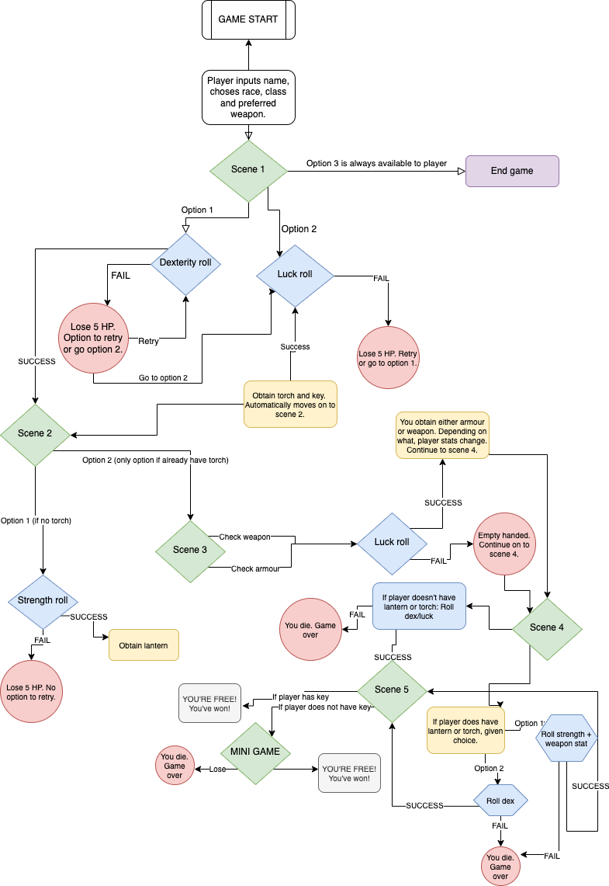
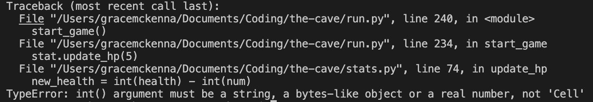

 

# Table of Contents

- [Table of Contents](#table-of-contents)
- [Site Overview](#site-overview)
  - [Goal](#goal)
  - [Technologies used](#technologies-used)
- [UX](#ux)
  - [Target Audience](#target-audience)
  - [User Stories](#user-stories)
- [Features](#features)
  - [Existing Features](#existing-features)
  - [Future Features](#future-features)
- [Design](#design)
- [Testing](#testing)
  - [Bugs](#bugs)
  - [Known Issues](#known-issues)
- [Deployment](#deployment)
  - [How to Fork](#how-to-fork)
- [Credits](#credits)
  - [Code](#code)
    - [Version Control](#version-control)
- [Acknowledgments](#acknowledgments)
   
  - [Future Features](#future-features)
- [Table of Contents](#table-of-contents)
- [Site Overview](#site-overview)
  - [Goal](#goal)
  - [Technologies used](#technologies-used)
- [UX](#ux)
  - [Target Audience](#target-audience)
  - [User Stories](#user-stories)
- [Features](#features)
  - [Existing Features](#existing-features)
  - [Future Features](#future-features)
- [Design](#design)
- [Testing](#testing)
  - [Bugs](#bugs)
  - [Known Issues](#known-issues)
- [Deployment](#deployment)
  - [How to Fork](#how-to-fork)
- [Credits](#credits)
  - [Code](#code)
    - [Version Control](#version-control)
- [Acknowledgments](#acknowledgments)

# Site Overview
Deployed Site: [Here](https://the-cave-rpg.herokuapp.com/)
The Cave is a text adventure RPG game where the player choses their race, class and preferred weapon. These initial decisions impact the player's stats in-game and whether or not they will be able to escape the cave alive! Decisions that impact the game are stored in Google Sheets and are retrieved when relevant to the game.

## Goal
I wanted to create a text based adventure game based on the "Choose your own adventure" books I used to read as a child, while also incorporating some Dungeons & Dragons elements to the game. My goal was to create something that has been done before but with an added twist of your decisions actually impacting whether or not luck will be on your side.

## Technologies used

- [Python](https://www.python.org/) for the main game-play.
- [GitHub](https://github.com/) as a remote repository.
- [Heroku](https://heroku.com) to deploy the website.
- [Visual Studio Code](https://code.visualstudio.com/) as a local IDE & repository.
- [diagram.net](https://diagram.net) for making the flowchart for the game.

# UX
## Target Audience

- Old school RPGers who would have played choose your own adventure novels in their youth
- People who are fans of Dungeons and Dragons
- Those who enjoy basic text adventure games
- Those who enjoy interactive novels
## User Stories

- As a user:

# Features

## Existing Features

## Future Features

# Design
Below is the flowchart I made to follow along while coding. I initially wrote this out on paper and then used [diagrams.net](https://www.diagrams.net/) to create it digitally.

# Testing
Testing document can be found [here](TESTING.md)
## Bugs

Bug | Status | Fix | Images of bug
----|--------|-----|--------------
Regardless of class chosen, player was only given warrior options for weapons | Resolved | Rather than just use '==' for one class and 'or' for second option, use '==' for both classes. | 
Large gap between line breaks instead of starting on new line | Resolved | Instead of using 'backslash', started new string. | 
Health points were not being updated after player suffers HP loss | Resolved | I had forgotten to add .value to the statement. | 
Using if statements in main file caused the failure function to trigger and prevented HP from updating | Resolved | Placed update hp function in events.py in failure function | 
Dagger would not upload to sheet and caused UnboundLocalError | Resolved | I only assigned the worksheet variable in one of the if statements rather than all of them. I fixed this by adding it to each if statement | 
Couldn't reach worksheet | Resolved | I accidentally mixed up functions and added "get_" before worksheet in my code | 
Start_game() function after player is asked if they want to play again doesn't start at the very beginning, instead at the start of wake_up() | Resolved | Enclosed code in variables.py in function and called function in run.py | 
Preferred weapon function gets confused due to uppercase or lower case entry by player | Resolved | Changed so player only types in lowercase |  
Error when attempting to run stat.roll_luck in luck_fail() functions | Resolved | Was missing () | 
After killing the skeleton in stage 4, game did not continue | Resolved | Forgot to add stage_5() after print statement | 
Game did not recognise player had light source if it was a lantern | Resolved | Changed if elif statement instead of multistatement | 
## Known Issues
- I am unsure how the game would work if more than one person tried to play at the same time. I believe because one person would overwrite the info of the other it would cause issues.

# Deployment 

## How to Fork
1. Login/signup to [GitHub](https://github.com/).
2. Locate the relevant repository - in this case [gracemcken/the-cave](https://github.com/gracemcken/the-cave)
3. Click on the 'Fork' button in the upper left.
4. Your forked version of this repo will be generated!
# Credits
## Code
- https://stackoverflow.com/questions/60608275/how-can-i-print-text-so-it-looks-like-its-being-typed-out for help with text speed. Also Eventyret_mentor for his help on this issue!

### Version Control
*   Git was used as the version control software. Commands such as git add ., git status, git commit and git push were used to add, save, stage and push the code to the GitHub repository where the source code is stored.

# Acknowledgments

As always, many many thanks you my partner for his patience while I worked on this project and of course my mentor Spencer and my friend Brynjar, who as always was an excellent rubber duck whenever I had an issue I couldn't work past.

